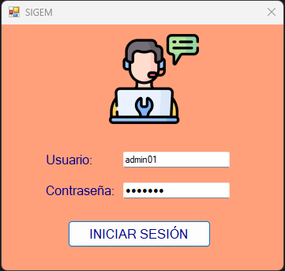
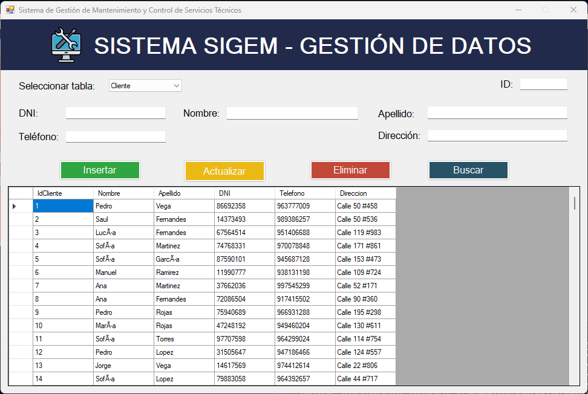

# 🛠️ Sistema de Gestión de Servicios Técnicos (SIGEM)

> **Solución End-to-End de Ingeniería de Datos y Desarrollo de Software**  
> Proyecto integral que abarca desde el modelado relacional de datos y procesos ETL, hasta el desarrollo de una aplicación de escritorio administrativa y la creación de un panel analítico interactivo en Power BI.

---

## 🚀 Arquitectura y Componentes del Proyecto

El sistema fue diseñado bajo una arquitectura por capas para simular un entorno de producción real:

1. **Base de Datos Relacional (SQL Server):** Diseño del modelo relacional, tablas, llaves primarias/foráneas, procedimientos almacenados y consultas analíticas avanzadas.
2. **Integración de Datos (ETL - SSIS):** Limpieza, transformación y carga masiva de archivos `.csv` externos hacia SQL Server utilizando *SQL Server Integration Services*.
3. **Aplicación Administrativa (C# - Windows Forms):** Sistema de escritorio para la gestión operativa (CRUD de clientes, equipos, órdenes de servicio) conectado mediante ADO.NET.
4. **Analítica de Negocio (Power BI):** Cuadro de mando interactivo para el monitoreo de KPIs clave, ingresos por servicio, estado de órdenes y rendimiento técnico.

---

## 📁 Estructura del Repositorio

Sistema-Gestion-Servicios-Tecnicos/
│
├── 01-Base-de-Datos/            # Scripts DDL/DML, vistas y Stored Procedures (SQL)
├── 02-Integracion-SSIS/         # Paquetes de integración ETL en SSIS (.sln)
├── 03-Aplicacion-Windows-Forms/ # Código fuente del sistema C# (SIGEM)
├── 04-Datos-Entrada/            # Fuentes de datos sin procesar (.csv)
├── 05-Analisis-Power-BI/        # Archivo .pbix y capturas del dashboard
├── 06-Python/                   # Scripts auxiliares de automatización y limpieza
└── 07-Documentacion/            # Capturas de la interfaz y manuales

---

## 💻 Vista Previa de la Aplicación C# (SIGEM)

### 1. Control de Acceso y Seguridad

### 2. Módulo de Gestión Operativa (CRUD)

---

## 📊 Dashboards Interactivos (Power BI)

### 1. Gestión de Órdenes de Servicio
Visión general del estado actual de las solicitudes, distribución de estados y seguimiento de órdenes pendientes.

### 2. Análisis de Equipos Registrados
Control detallado sobre las marcas, tipos de equipos ingresados y volumen de fallas presentadas.

### 3. Rendimiento Técnico e Ingresos
Análisis financiero de los servicios prestados y evaluación de la productividad del personal técnico.

---

## 🛠️ Tecnologías Utilizadas

* **Base de Datos:** Microsoft SQL Server
* **Integración:** SQL Server Integration Services (SSIS)
* **Lenguajes:** C#, T-SQL, DAX, Python
* **Frontend / GUI:** Windows Forms (.NET Framework)
* **Business Intelligence:** Power BI Desktop